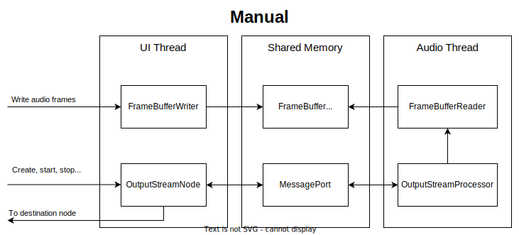
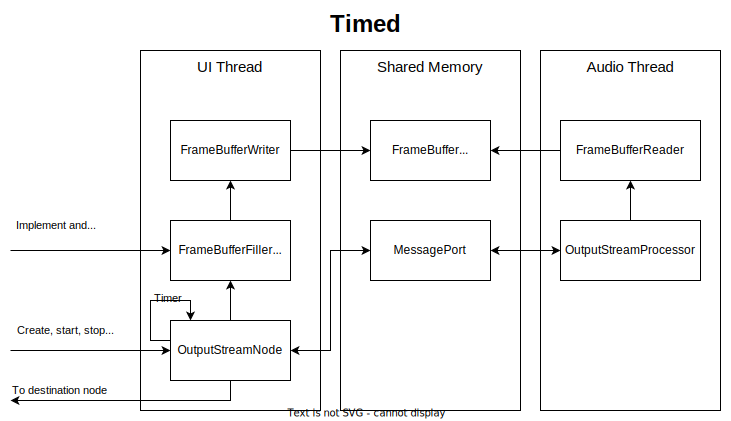
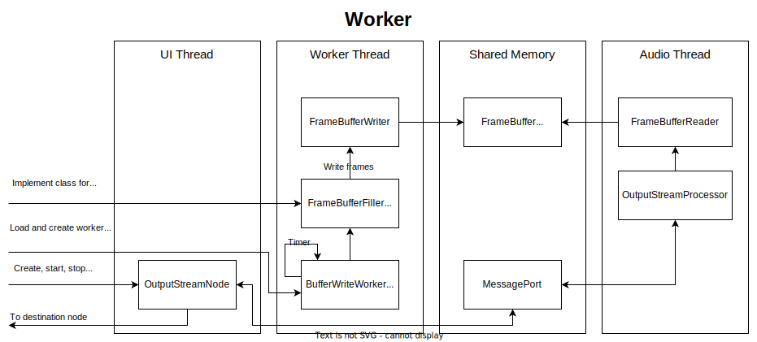

# Audio Worklet Stream Library

[](https://badge.fury.io/js/@ain1084%2Faudio-worklet-stream)
[](https://github.com/ain1084/audio-worklet-stream/actions?query=workflow%3Adocs)
[](https://opensource.org/licenses/MIT)
[](https://opensource.org/licenses/Apache-2.0)

This library provides a way to work with audio worklets and streams using modern web technologies. It allows for the manual writing of audio frames to a buffer and supports various buffer writing strategies.

This library was created for use in my project [fbdplay_wasm](https://github.com/ain1084/fbdplay_wasm). In this project, we utilize only a very limited set of WebAudio functionalities. It might lack features for general use.

## Features

- **Manual Buffer Writing**: Provides the ability to manually write audio frames to a buffer.
- **Multiple Buffer Writing Strategies**: Includes support for manual, timer-based, and worker-based buffer writing.
- **Worker-Based Stability**: Utilizes Workers to ensure stable and consistent audio playback, reducing the impact of UI thread throttling.
- **Vite Integration**: Leverages Vite for easy worker loading and configuration without complex setup.
- **Audio Worklet Integration**: Seamlessly integrates with the Web Audio API's Audio Worklet for real-time audio processing.
- **Optimized Performance**: Designed for efficient real-time audio processing with batch frame handling.

## Browser Compatibility

<details>
<summary>Click to expand browser compatibility details</summary>

This library uses modern Web APIs and is designed for contemporary browsers only. Tested and confirmed working on:

|Feature|Chrome|Chrome (Android)|Firefox|Safari (macOS)|Safari (iOS)|Edge|Opera|
|:--|:--:|:--:|:--:|:--:|:--:|:--:|:--:|
|Basic Support|✅|✅|✅|✅|❓|✅|❓|
|Manual Buffer Writing|✅|✅|✅|✅|❓|✅|❓|
|Timer-Based Buffer Writing|✅|✅|✅|🔺|❓|✅|❓|
|Worker-Based Stability|✅|✅|✅|✅|❓|✅|❓|

Legend:

- ✅: Confirmed and working without issues
- 🔺: Confirmed with limitations (e.g., unstable in background operation)
- ❓: Not yet confirmed

Note: Compatibility with Safari on iOS has not been confirmed due to lack of test devices.

To check compatibility in your environment, please run the demo in the example directory.

</details>

## Prerequisites

- **Node.js** and **npm**: Make sure you have Node.js (version 20 or higher) and npm installed. This library hasn't been tested on versions below 20.
- **Vite**: This library uses Vite as the bundler for its simplicity in loading and configuring workers.

## Installation

To install the library, run:

```bash
npm install @ain1084/audio-worklet-stream
```

<details>
<summary>Click to view configuration details</summary>

You need to add `@ain1084/audio-worklet-stream` to the optimizeDeps.exclude section in `vite.config.ts`. Furthermore, include the necessary **COOP (Cross-Origin Opener Policy)** and **COEP (Cross-Origin Embedder Policy)** settings to enable the use of `SharedArrayBuffer`.

### vite.config.ts

```typescript
import { defineConfig } from 'vite'

export default defineConfig({
  optimizeDeps: {
    exclude: ['@ain1084/audio-worklet-stream']
  },
  plugins: [
    {
      name: 'configure-response-headers',
      configureServer: (server) => {
        server.middlewares.use((_req, res, next) => {
          res.setHeader('Cross-Origin-Embedder-Policy', 'require-corp')
          res.setHeader('Cross-Origin-Opener-Policy', 'same-origin')
          next()
        })
      },
    },
  ],
})
```

If you are using Nuxt3, add it under vite in `nuxt.config.ts`.

### nuxt.config.ts

```typescript
export default defineNuxtConfig({
  vite: {
    optimizeDeps: {
      exclude: ['@ain1084/audio-worklet-stream']
    },
    plugins: [
      {
        name: 'configure-response-headers',
        configureServer: (server) => {
          server.middlewares.use((_req, res, next) => {
            res.setHeader('Cross-Origin-Embedder-Policy', 'require-corp')
            res.setHeader('Cross-Origin-Opener-Policy', 'same-origin')
            next()
          })
        },
      },
    ],
  },
  nitro: {
    rollupConfig: {
      external: '@ain1084/audio-worklet-stream',
    },
    routeRules: {
      '/**': {
        headers: {
          'Cross-Origin-Embedder-Policy': 'require-corp',
          'Cross-Origin-Opener-Policy': 'same-origin',
        },
      },
    },
  },
})
```

</details>

## Usage

### Overview

This library continuously plays audio sample frames using AudioWorkletNode. The audio sample frames need to be supplied externally via a ring buffer. The library provides functionality to retrieve the number of written and read (played) frames and allows stopping playback at a specified frame.

The output-only AudioNode is implemented by the OutputStreamNode class, which inherits from AudioWorkletNode. This class adds functionalities such as stream playback, stopping, and retrieving playback position to the AudioWorkletNode.

Instances of OutputStreamNode cannot be constructed directly. First, an instance of StreamNodeFactory needs to be created. The StreamNodeFactory is instantiated by calling its static create method with a BaseAudioContext as an argument. This method internally loads the necessary modules. Then, through the returned instance, the construction of OutputStreamNode becomes possible.

The library does not handle the construction or destruction of AudioContext. When constructing AudioContext, be sure to do so in response to a user interaction, such as a UI event (e.g., button press).

Example:

```typescript
let audioContext: AudioContext | null = null
let factory: StreamNodeFactory | null = null

const clicked = async () => {
  if (!audioContext) {
    audioContext = new AudioContext()
    factory = await StreamNodeFactory.create(audioContext)
  }
  const { node, writer } = await factory.createManualBufferNode(
    { channelCount: 2, frameBufferSize: 4096 }
  )
}
```

### Buffer Writing Methods

As outlined in the overview, OutputStreamNode requires external audio samples. These samples must be written to a ring buffer, and there are several methods to achieve this.

**Note**: The diagrams are simplified for ease of understanding and may differ from the actual implementation.

#### Manual



- This method involves manually writing to the ring buffer. Use the `OutputStreamFactory.createManualBufferNode` method, specifying the number of channels and frames to create an `OutputStreamNode`. The `FrameBufferWriter`, used for writing to the ring buffer, is also returned by this method along with the `OutputStreamNode`.
- When the `OutputStreamNode` is first constructed, the ring buffer is empty. You must write to the buffer before starting playback to avoid audio gaps. While the node is playing, you must continue writing to the ring buffer to prevent audio frame depletion (which would cause silence).
- If the audio frames run out, the stream playback continues with the node outputting silence.
- To stop the stream playback, call the `stop()` method of `OutputStreamNode`. You can specify the frame at which to stop playback. For example, calling stop() with a frame count stops playback at that exact frame. If you want to play all the written frames, you can specify the total number of written frames, which can be obtained via the `FrameBufferWriter`.

#### Timed



- This method writes to the ring buffer using a timer initiated on the UI thread. Create it using the `OutputStreamFactory.createTimedBufferNode()` method, specifying the number of channels, the timer interval, and the `FrameBufferFiller` that supplies samples to the buffer.
- Writing to the ring buffer is handled by the FrameBufferFiller. The timer periodically calls the fill method of the `FrameBufferFiller`, which supplies audio frames via the `FrameBufferWriter`.
- If the audio frames run out, the stream playback continues with the node outputting silence.
- If the fill method of the `FrameBufferFiller` returns false, it indicates that no more audio frames are available. Once `OutputStreamNode` outputs all the written frames, the stream automatically stops and disconnects.
- Like the Manual method, you can also stop playback at any time using the `stop()` method.

#### Worker



- Similar to the Timed method, this method uses a timer to write to the ring buffer, but the timer runs within a Worker. This approach reduces the impact of UI thread throttling, providing more stable playback.
- Create it using the `OutputStreamFactory.createWorkerBufferNode()` method.
- Writing to the ring buffer occurs within the Worker.
- While the ring buffer writing is still managed by the `FrameBufferFiller`, the instance must be created and used within the Worker.
- The `FrameBufferFiller` implementation is instantiated within the Worker.
- You need to create a custom Worker. However, helper implementations are available to simplify this process. Essentially, you only need to specify the `FrameBufferFiller` implementation class within the Worker.
- Depending on how you implement the `FrameBufferFiller` class, you can use the same implementation as the Timed method.

**Note**: Any data passed from the UI thread to the Worker (such as fillerParams in the WorkerBufferNodeParams<T>) must be serializable (e.g., primitives, arrays, objects). Non-serializable values like functions or DOM elements cannot be passed.

### Buffer Underrun Handling

- When the buffer becomes empty, silent audio is output instead of throwing an error.
- The AudioNode continues to operate and consume CPU resources even during silent output.
- Normal audio output resumes automatically when new audio data is supplied.
- An UnderrunEvent is emitted upon recovery from an underrun, reporting the duration of silence (note: this is a post-event notification).

## Details of Configuration Parameters

<details>
<summary>Click to view details about configuration parameters</summary>

Understanding these parameters is crucial for optimal audio performance:

### channelCount (All strategies)

- Specifies the number of audio channels (e.g., 2 for stereo).
- Determines the sample composition within each frame.

### frameBufferSize (Manual strategy only)

- Defines the size of the ring buffer in frames.
- For continuous streaming, new frames must be supplied before buffer depletion.
- Larger size: Less susceptible to interruptions, but increases latency.
- Smaller size: Requires more frequent writes, potentially increasing CPU load.
- Manual strategy: Must be specified.
- Timed/Worker strategies: Calculated internally based on fillInterval.

### fillInterval (Timed and Worker strategies only)

- Specifies the interval for buffer refill timer.
- Default: 20ms.

### frameBufferChunks (Timed and Worker strategies only)

- Specifies the number of chunks in the total buffer size.
- Default: 5.

Example calculation:
For 48kHz sample rate and 20ms fillInterval:

- One chunk size = 48000 * 0.02 = 960 frames
- Total buffer size with default 5 chunks = 960 * 5 = 4800 frames

The actual values may slightly differ from the above because they are rounded up to 128 frame units.

</details>

## API Documentation

You can find the full API documentation [here](https://ain1084.github.io/audio-worklet-stream/).

## Example

<details>
<summary>Click to view example details</summary>

The example can be found at [example](https://github.com/ain1084/audio-worklet-stream/tree/main/example).

The provided example demonstrates how to use the library to manually write audio frames to a buffer. It includes:

- **Main Application** ([example/src/main.ts](https://github.com/ain1084/audio-worklet-stream/blob/main/example/src/main.ts)): Sets up and starts the audio stream using different buffer writing strategies.
- **Sine Wave Filler** ([example/src/sine-wave-frame-buffer-filler.ts](https://github.com/ain1084/audio-worklet-stream/blob/main/example/src/sine-wave-frame-buffer-filler.ts)): Implements a frame buffer filler that generates a sine wave.
- **Sine Wave Generator** ([example/src/sine-wave-generator.ts](https://github.com/ain1084/audio-worklet-stream/blob/main/example/src/sine-wave-generator.ts)): Generates sine wave values for the buffer filler.
- **Worker** ([example/src/worker.ts](https://github.com/ain1084/audio-worklet-stream/blob/main/example/src/worker.ts)): Sets up a worker to handle buffer filling tasks.
- **HTML Entry Point** ([example/index.html](https://github.com/ain1084/audio-worklet-stream/blob/main/example/index.html)): Provides the HTML structure and buttons to control the audio stream.

For more details, refer to the [example/README.md](https://github.com/ain1084/audio-worklet-stream/blob/main/example/README.md).

</details>

## Performance Optimization Guide

<details>
<summary>Click to expand performance optimization details</summary>

This guide provides tips and best practices for optimizing the performance of your audio application using the Audio Worklet Stream Library.

### Batch Processing

Our library is optimized for processing audio frames in large batches. To maximize performance:

1. When implementing your own audio generation or processing logic, work with larger chunks of audio data whenever possible.
2. Utilize the library's ability to handle multiple frames at once in your buffer filling strategies.

### Buffer Size Considerations

- Larger buffer sizes can improve performance but may increase latency.
- Experiment with different buffer sizes to find the optimal balance between performance and latency for your specific use case.

### Worker-Based Strategy

For the most stable playback, especially in scenarios where the main thread might be busy:

1. Use the Worker-based buffer writing strategy.
2. Implement computationally intensive tasks within the Worker to avoid impacting the main thread.

### Memory Management

- When working with multiple audio streams, be mindful of memory usage.
- For scenarios requiring numerous concurrent audio streams, pay attention to the creation and resource management of each stream. Consider properly releasing unused streams when necessary.

### Avoid Frequent AudioContext Creation

- Creating new AudioContext instances is expensive. Reuse existing contexts when possible.
- If your application requires multiple audio streams, try to use a single AudioContext for all of them.

### Profiling and Monitoring

- Use browser developer tools to profile your application and identify performance bottlenecks.
- Monitor CPU usage and audio underruns to ensure smooth playback.

By following these guidelines, you can ensure that your audio application runs efficiently and provides a smooth user experience.

</details>

## Advanced Usage Guide

<details>
<summary>Click to expand advanced usage details</summary>

This guide covers advanced usage scenarios and techniques for the Audio Worklet Stream Library.

### Advanced Worker Usage

For complex audio processing tasks:

1. Create a custom Worker that extends `BufferFillWorker`.
2. Implement advanced audio processing algorithms within the Worker.
3. Use `SharedArrayBuffer` for efficient data sharing between the main thread and the Worker.

### Handling Multiple Audio Streams

When working with multiple audio streams:

1. Create separate `OutputStreamNode` instances for each stream.
2. Manage their lifecycle and synchronization carefully.
3. Consider implementing a mixer if you need to combine multiple streams.

### Integrating with Other Web Audio API Features

You can combine this library with other Web Audio API features:

1. Connect the `OutputStreamNode` to other AudioNodes for additional processing.
2. Use AnalyserNode for visualizations.
3. Implement spatial audio using PannerNode.

### Error Handling and Debugging

For robust applications:

1. Implement comprehensive error handling, especially for Worker-based strategies.
2. Use the UnderrunEvent to detect and handle buffer underruns.
3. Implement logging or metrics collection for performance monitoring.

These advanced techniques will help you leverage the full power of the Audio Worklet Stream Library in complex audio applications.

</details>

## Troubleshooting Guide

<details>
<summary>Click to expand troubleshooting details</summary>

This guide helps you troubleshoot common issues when using the Audio Worklet Stream Library.

### Audio Playback Issues

#### No Sound

1. Check if your AudioContext is in the 'running' state. It may need to be resumed after user interaction.
2. Ensure your OutputStreamNode is properly connected to the AudioContext destination.
3. Verify that you're writing audio data to the buffer correctly.

#### Choppy or Glitchy Playback

1. Increase your buffer size to reduce the chance of underruns.
2. If using the Timed strategy, consider switching to the Worker strategy for more stable playback.
3. Check your system's CPU usage. High CPU usage can cause audio glitches.

### Buffer Underruns

If you're experiencing frequent UnderrunEvents:

1. Increase your buffer size.
2. Optimize your audio data generation/loading process.
3. If using the Manual strategy, ensure you're writing to the buffer frequently enough.

### Worker-Related Issues

#### Worker Not Starting

1. Ensure your Worker file is in the correct location and properly bundled.
2. Check for any console errors related to Worker initialization.

#### Data Not Being Processed in Worker

1. Verify that your FrameBufferFiller implementation in the Worker is correct.
2. Check the message passing between the main thread and the Worker.

### Browser Compatibility Issues

#### Feature Not Working in Specific Browsers

1. Refer to the Browser Compatibility table in the README.
2. Ensure you're using the latest version of the browser.
3. Check if the required features (like SharedArrayBuffer) are enabled in the browser.

### Build and Integration Issues

#### Module Not Found Errors

1. Ensure `@ain1084/audio-worklet-stream` is properly installed.
2. Check your bundler configuration, especially the `optimizeDeps.exclude` setting in Vite.

#### Browser Errors

1. Verify that you've set the correct **COOP (Cross-Origin Opener Policy)** and **COEP (Cross-Origin Embedder Policy)** headers as described in the installation instructions.
2. If using a development server, ensure it's configured to send the required headers.

### Performance Issues

If you're experiencing poor performance:

1. Profile your application using browser developer tools.
2. Consider using the Worker strategy for computationally intensive tasks.
3. Optimize your audio processing algorithms.

If you're still facing issues after trying these solutions, please open an issue on our GitHub repository with a detailed description of the problem and steps to reproduce it.

</details>

## Known Issues and Workarounds

<details>
<summary>Click to view known issues and workarounds</summary>

### SSR and Import Errors with ESM Modules

When using `@ain1084/audio-worklet-stream` in a Nuxt 3 project, you may encounter issues during SSR (Server-Side Rendering) or when importing the package as an ESM module. This can result in errors like:

```bash
[nuxt] [request error] [unhandled] [500] Cannot find module '/path/to/node_modules/@ain1084/audio-worklet-stream/dist/esm/events' imported from '/path/to/node_modules/@ain1084/audio-worklet-stream/dist/esm/index.js'
```

### Workarounds

1. **Disable SSR for the Component**

   You can disable SSR for the component that uses the package. This can be done by using `<client-only>`:

   ```vue
   <client-only>
     <MyComponent />
   </client-only>
   ```

2. **Use ssr: false in nuxt.config.ts**

   You can disable SSR for the entire project in `nuxt.config.ts`:

   ```typescript
   export default defineNuxtConfig({
     ssr: false,
     // other configurations
   })
   ```

3. **Use import.meta.server and import.meta.client**

   For a more granular control, you can use `import.meta.server` and `import.meta.client` to conditionally import the module only on the client-side. Note that this method is more complex compared to 1 and 2:

   ```typescript
   if (import.meta.client) {
     const { StreamNodeFactory } = await import('@ain1084/audio-worklet-stream');
     // Use StreamNodeFactory
   }
   ```

### Example Configuration

To ensure proper operation, it is essential to use `ssr: false` or `<client-only>` for components and to exclude `@ain1084/audio-worklet-stream` from Vite's optimization in your `nuxt.config.ts`:

```typescript
export default defineNuxtConfig({
  ssr: false, // or use <client-only> for specific components
  vite: {
    optimizeDeps: {
      exclude: ['@ain1084/audio-worklet-stream']
    },
    plugins: [
      {
        name: 'configure-response-headers',
        configureServer: (server) => {
          server.middlewares.use((_req, res, next) => {
            res.setHeader('Cross-Origin-Embedder-Policy', 'require-corp')
            res.setHeader('Cross-Origin-Opener-Policy', 'same-origin')
            next()
          })
        },
      },
    ],
  },
  nitro: {
    rollupConfig: {
      external: '@ain1084/audio-worklet-stream',
    },
    // Ensure COEP and COOP settings for SharedArrayBuffer
    routeRules: {
      '/**': {
        headers: {
          'Cross-Origin-Embedder-Policy': 'require-corp',
          'Cross-Origin-Opener-Policy': 'same-origin',
        },
      },
    },
  },
})
```

</details>

## Future Plans

We are considering potential enhancements for future releases, including:

- Buffer management optimization: We are considering ways to improve memory efficiency and initialization time, especially when dealing with multiple audio streams.

Please note that these are just considerations and may or may not be implemented in future versions. We always aim to balance new features with maintaining the library's stability and simplicity.

## Notes

- **Vite as a Bundler**: This library utilizes Vite to enable the loading and placement of workers without complex configurations. It may not work out-of-the-box with WebPack due to differences in how bundlers handle workers. While similar methods may exist for WebPack, this library currently only supports Vite. Initially, a bundler-independent approach was considered, but a suitable method could not be found.

- **Security Requirements**: Since this library uses `SharedArrayBuffer`, ensuring browser compatibility requires meeting specific security requirements. For more details, refer to the [MDN Web Docs on SharedArrayBuffer Security Requirements](https://developer.mozilla.org/en-US/docs/Web/JavaScript/Reference/Global_Objects/SharedArrayBuffer#security_requirements).

## Contribution

Contributions are welcome! Please open an issue or submit a pull request on GitHub.

## License

This project is licensed under multiple licenses:

[](https://opensource.org/licenses/MIT)
[](https://opensource.org/licenses/Apache-2.0)

You can choose either license depending on your project needs.

Unless you explicitly state otherwise, any contribution intentionally submitted for inclusion in the work by you, as defined in the Apache-2.0 license, shall be dual licensed as above, without any additional terms or conditions.
